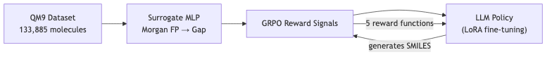
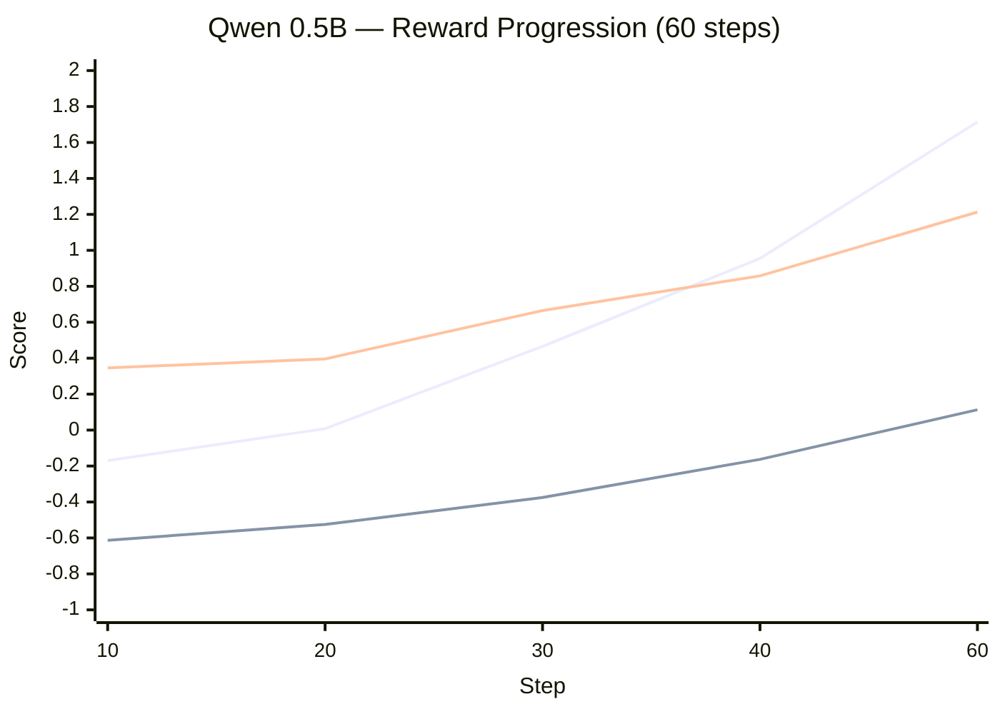

# RLVR-Sci Experiment Report

---

## 1. Research Overview

This project implements **Reinforcement Learning from Verifiable Reward (RLVR)** for **scientific hypothesis generation** — specifically, teaching LLMs to generate novel chemical molecules (as SMILES strings) with targeted physical properties (HOMO-LUMO gap).

The key innovation is a **fast surrogate verifier** (an MLP trained on QM9 data) that approximates expensive DFT quantum-chemistry calculations, making it feasible to run inside an RL training loop. The RL algorithm is **Group Relative Policy Optimization (GRPO)** via HuggingFace `trl`.

### Reward Function Architecture

| # | Reward | Weight | Description |
|---|--------|--------|-------------|
| 1 | **Validity** | 1.0 | RDKit parse check — valid SMILES = +1.0, invalid = −1.0 |
| 2 | **Surrogate Gap** | 1.0 | Normalized predicted HOMO-LUMO gap from the MLP verifier |
| 3 | **Novelty** | 0.5 | Penalizes Tanimoto similarity ≥ 0.85 to QM9 training molecules |
| 4 | **Diversity** | 0.3 | Rewards structurally diverse completions within each prompt group |
| 5 | **Conditional Target** | 0.5 | For property-conditioned prompts, rewards meeting the requested gap threshold |

---

## 2. Dataset & Surrogate Verifier

### QM9 Dataset

| Metric | Value |
|--------|-------|
| Source | [DeepChem QM9 CSV](https://deepchemdata.s3-us-west-1.amazonaws.com/datasets/qm9.csv) |
| Total molecules | **133,885** |
| Invalid fingerprints | 0 |
| Fingerprint dims | 133,885 × 2048 (Morgan FPs, radius=2) |
| Gap range | 0.0246 – 0.6221 Hartree |
| Gap mean ± std | 0.2511 ± 0.0475 Hartree |
| Volume file | `qm9_processed.csv` (2.9 MiB) + `qm9_fingerprints.npy` (261.5 MiB) |

### Surrogate Verifier Performance

| Metric | Value |
|--------|-------|
| **Test R²** | **0.9488** |
| **Test MSE** | **1.168 × 10⁻⁴** |
| R² gate threshold | 0.70 |
| Architecture | MLP (256, 128) with early stopping |
| Model file | `surrogate_gap_model.joblib` (12.8 MiB) |

> [!TIP]
> R² = 0.949 is excellent — the surrogate explains ~95% of the variance in HOMO-LUMO gap from fingerprints alone, far exceeding the 0.70 gate.

---

## 3. LoRA Configuration (All Runs)

All three GRPO runs used identical LoRA adapters:

| Parameter | Value |
|-----------|-------|
| PEFT type | LoRA |
| Rank (r) | 16 |
| Alpha | 32 |
| Dropout | 0.05 |
| Bias | none |
| Target modules | `q_proj`, `k_proj`, `v_proj`, `o_proj`, `gate_proj`, `up_proj`, `down_proj` |
| Task type | CAUSAL_LM |
| DoRA | false |
| RSLoRA | false |

---

## 4. Training Results

### 4.1 Smoke Test — Qwen2.5-0.5B-Instruct (10 steps)

**Config:** 50 prompts · 10 steps · batch=4 · 4-bit NF4 · L4 GPU

| Metric | Step 10 (train) | Step 10 (eval) |
|--------|-----------------|----------------|
| **Total Reward** | — | **−0.777** |
| Reward std | — | 0.447 |
| Loss | −0.066 | −0.011 |
| Validity | — | **−0.900** |
| Surrogate gap | — | **+0.108** |
| Novelty | — | **−0.050** |
| Diversity | — | **+0.050** |
| Conditional gap | — | NaN (skipped) |
| Completion length | — | 39.3 tokens |
| Clip ratio | — | 0.0 |

> [!NOTE]
> The smoke test only ran 10 steps — too few for meaningful learning. Validity at −0.9 means 95% of outputs were invalid SMILES. This is expected for a 0.5B model with negligible training. The test verified pipeline correctness, not model quality.

---

### 4.2 Integration Test — Qwen2.5-0.5B-Instruct (60 steps)

**Config:** 180 prompts · 60 steps · batch=4 · 4-bit NF4 · L4 GPU

#### Training Reward Progression

| Step | Total Reward | Validity | Surrogate | Novelty | Diversity | Grad Norm | Compl. Len |
|------|-------------|----------|-----------|---------|-----------|-----------|------------|
| 10 | **−0.170** | −0.613 | +0.346 | +0.103 | +0.118 | 2.36 | 53.0 |
| 20 | **+0.008** | −0.525 | +0.396 | +0.109 | +0.173 | 3.18 | 62.1 |
| 30 | **+0.466** | −0.375 | +0.665 | +0.200 | +0.119 | 5.95 | 58.1 |
| 40 | **+0.955** | −0.163 | +0.858 | +0.274 | +0.202 | 9.77 | 63.0 |
| 60 | **+1.714** | **+0.113** | **+1.213** | **+0.395** | +0.195 | 6.03 | 71.1 |

#### Eval at Step 50

| Metric | Value |
|--------|-------|
| **Eval Reward** | **+1.001** |
| Eval Validity | **−0.167** |
| Eval Surrogate | **+0.847** |
| Eval Novelty | **+0.266** |
| Eval Diversity | +0.194 |
| Eval Completion Length | 70.6 tokens |

#### Trend Analysis

> [!IMPORTANT]
> **Clear learning signal detected.** Over 60 steps:
> - **Validity** flipped from −0.61 → **+0.11** (model learned to produce valid SMILES)
> - **Surrogate gap** nearly quadrupled: 0.35 → **1.21** (model learned to optimize for higher HOMO-LUMO gap)
> - **Novelty** improved steadily: 0.10 → **0.40** (model generates increasingly novel molecules)
> - **Total reward** grew monotonically from −0.17 → **+1.71**
> - Gradient norm peaked at step 40 (9.77) then stabilized at 6.03 — healthy training dynamics

---

### 4.3 Integration Test — Mistral-7B-Instruct-v0.2 (25 steps)

**Config:** 100 prompts · 25 steps · batch=4 · 4-bit NF4 · L4 GPU · 24 GiB memory

#### Training Reward Progression

| Step | Total Reward | Validity | Surrogate | Novelty | Diversity | Grad Norm | Compl. Len |
|------|-------------|----------|-----------|---------|-----------|-----------|------------|
| 10 | **+0.051** | −0.438 | +0.307 | +0.220 | +0.138 | 1.81 | 91.2 |
| 20 | **+0.536** | **+0.088** | +0.016 | +0.429 | +0.332 | 2.64 | 111.7 |

#### Eval at Step 25

| Metric | Value |
|--------|-------|
| **Eval Reward** | **+1.059** |
| Eval Validity | **+0.450** |
| Eval Surrogate | +0.061 |
| Eval Novelty | **+0.606** |
| Eval Diversity | **+0.384** |
| Eval Completion Length | 117.6 tokens |
| Eval Runtime | 505.5s |

> [!IMPORTANT]
> **Mistral-7B learns faster than Qwen-0.5B.** Key observations:
> - **Validity flipped positive by step 20** (+0.088 train, +0.45 eval) — the larger model already produces valid SMILES majority of the time after just 20 steps, vs ~50 steps for Qwen
> - **Novelty is the strongest reward** at +0.606 eval — Mistral generates structurally distinct molecules far from QM9
> - **Diversity is high** at +0.384 eval — within-group molecular variety
> - **Surrogate gap is low** (+0.061 eval) — the model optimizes for novelty/validity rather than high HOMO-LUMO gap at this early stage. This is expected: the model first learns to output valid, novel SMILES before learning to maximize the specific property
> - **Longer completions** (117.6 tokens vs 70.6 for Qwen) — Mistral generates more verbose outputs with richer molecular descriptions
> - **Gradient norms are lower** (1.8–2.6 vs 2.4–9.8 for Qwen) — more stable optimization in the larger model

---

## 5. Cross-Model Comparison

| Metric | Qwen 0.5B (60 steps) | Mistral 7B (25 steps) |
|--------|----------------------|-----------------------|
| **Final eval reward** | +1.001 | **+1.059** |
| **Eval validity** | −0.167 | **+0.450** |
| **Eval surrogate** | **+0.847** | +0.061 |
| **Eval novelty** | +0.266 | **+0.606** |
| **Eval diversity** | +0.194 | **+0.384** |
| Steps to valid SMILES | ~50 | **~20** |
| Adapter size | 33.6 MiB | 160.1 MiB |
| Completion length | 70.6 tokens | 117.6 tokens |

> [!TIP]
> **Mistral-7B reaches higher overall reward in fewer steps** and excels at validity, novelty, and diversity. Qwen-0.5B excels at surrogate gap optimization (producing high-gap molecules). With more training steps, Mistral should learn to also optimize the surrogate gap — making it the clear candidate for the full 500-step production run.
